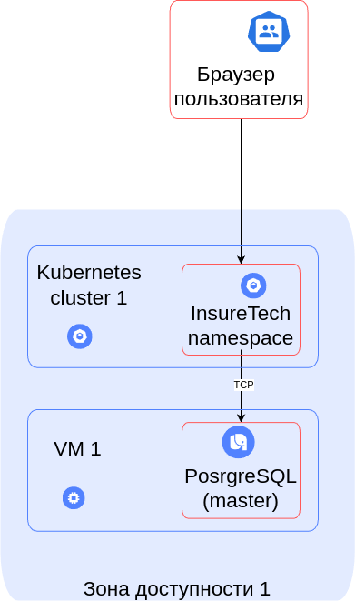
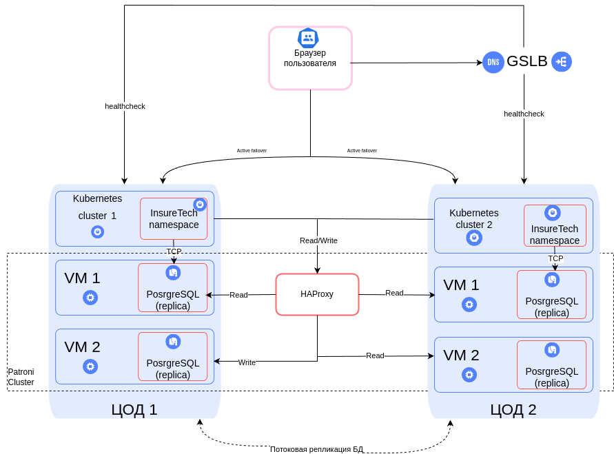

### Задание 1. Проектирование технологической архитектуры
Компания хочет сделать упор на развитие в регионах РФ. Планируется значительный рост количества пользователей и запросов.
Нужно обеспечить бесперебойную работу сервиса 24/7, при этом сервис должен обслуживать клиентов из всех часовых поясов.

Требования к отказоустойчивости системы крайне высокие: RTO — 45 мин., RPO — 15 мин.
Согласно требованиям бизнеса, доступность приложения должна быть равна 99,9%.

Дополнительно к этому нужно обеспечить одинаковое время загрузки страниц для пользователей из разных регионов.
Оно не должно зависеть от географического местоположения пользователя.

На текущий момент сервис хранит ограниченный набор данных, который включает в себя:
- базовую информацию о клиентах — ФИО, контакты, документы,
- информацию о продуктах и тарифах,
- историю заявок клиентов.

Общий объём данных, которые хранятся в системе, равен 50 GB.

### Что нужно сделать:
Необходимо спроектировать технологическую архитектуру приложения так, чтобы оно отвечало требованиям бизнеса.
Создайте схему итогового решения на основании текущей технологической архитектуры сервиса.

### Новая гео-распределенная архитектура:

### Изначальная схема:

### Схема итогового решения:
