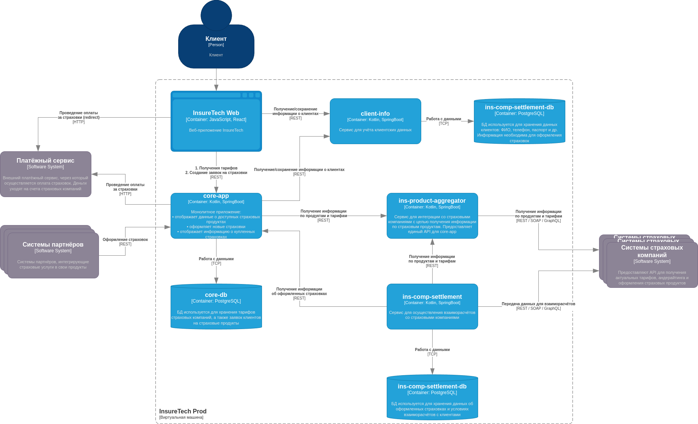
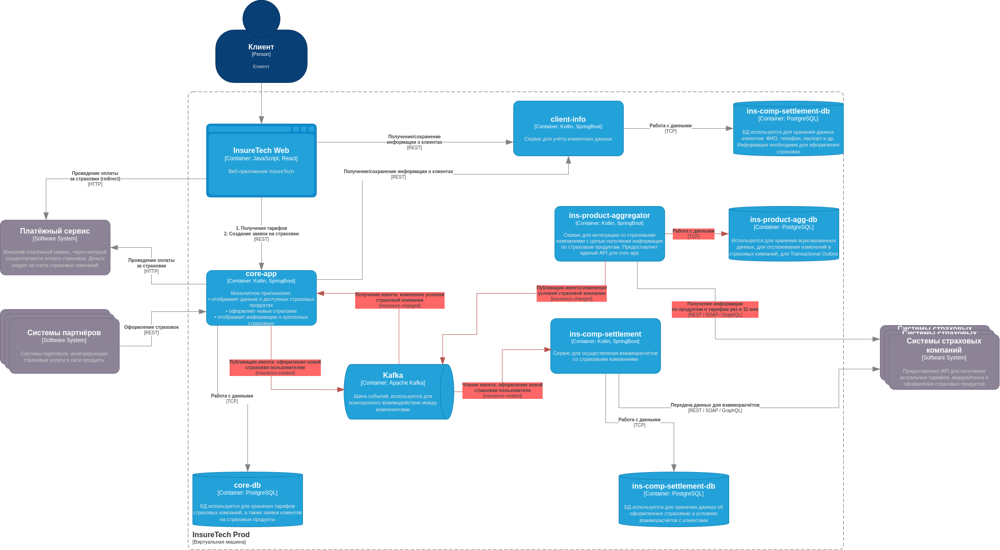

### Задание 3. Переход на Event-Driven архитектуру:
Сервисы core-app и ins-comp-settlement получают данные о доступных продуктах через REST API сервиса ins-product-aggregator. В момент вызова он:
* запрашивает информацию из всех страховых компаний (сейчас их пять),
* агрегирует её в единый список,
* возвращает этот список в рамках того же синхронного запроса.

Чтобы ускорить работу сервисов, при изначальном проектировании команда решила хранить локальные реплики данных о продуктах и тарифах в сервисах core-app и ins-comp-settlement.

Сервис core-app осуществляет запрос к ins-product-aggregator раз в 15 минут, а ins-comp-settlement — раз в сутки (ночью), при формировании реестра оформленных страховок. Иногда команда сталкивается с ошибками взаимодействия между этими сервисами. Они связаны с задержками ответов или ошибками при взаимодействии с API страховых компаний.

Дополнительно сервис ins-comp-settlement раз в сутки осуществляет запрос в core-app по REST API для получения всех оформленных за день страховок. Эти данные он использует.

В ближайшее время InsureTech планирует подписать агентское соглашение ещё с пятью страховыми компаниями. Вам предстоит спроектировать решение, которое устранит текущие проблемы.

### Что нужно сделать:
1. Проанализируйте текущую архитектуру. Создайте текстовый документ и напишите там список проблем и рисков, которые связаны с планируемым ростом нагрузки. Когда всё будет готово, загрузите документ в директорию Task3 в рамках пул-реквеста.
2. Обновите диаграмму контейнеров InsureTech, предложив решения для выявленных вами рисков и проблем. При этом:
   Не меняя декомпозицию функциональности между сервисами, подумайте, какие взаимодействия стоит переделать на Event-Streaming.
   Решите, будете ли вы использовать паттерн Transactional Outbox.
   Когда схема будет готова, загрузите её в директорию Task3 в рамках пул-реквеста.

### Список проблем и рисков:
В текущей реализации монолит `core-app` раз в 15 минут запрашивает данные у сервиса-агрегатора `ins-product-aggregator`,
а тот, в свою очередь, обращается к страховым компаниям. Это необходимо для поддержания актуального состояния базы данных
и предоставления пользователям сервиса по оформлению страховок.

В то же время `ins-comp-settlement` раз в сутки обращается к агрегатору `ins-product-aggregator` и монолиту `core-app`,
чтобы получить новые заявки от монолита, а также актуальные условия страховых компаний от агрегатора.
После выполнения вычислений он взаимодействует с внешними сервисами для подтверждения оплат.

### Риски увеличения нагрузки на внешние системы:
* Увеличенный объем данных, передаваемых от агрегатора к монолиту.
* Увеличенный объем агрегируемых данных на стороне агрегатора.
* Увеличение связанности между компонентами.
* Повышенный риск ошибок и отказов внешних систем.
* Увеличенная нагрузка на каждый участок цепи.
* Отсутствие гарантии передачи данных во время выполнения синхронных запросов (раз в 15 мин и раз в 24 часа).
* В случае ошибок невозможно применить обработку ошибок — запросы к сервисам завершаются сбоем,
  и дальнейшие процессы не выполняются.
* Повышенная нагрузка раз в сутки на `ins-product-aggregator` от `ins-comp-settlement`
* Повышенная нагрузка раз в сутки на монолит `core-app` от `ins-comp-settlement`
* Паттерн Outbox предлагаю применить для сервиса `ins-product-aggregator`, чтобы не терять данные от внешних сервисов и не отправлять данные дважды.

### Диаграмма компонентов системы as-is:

### Диаграмма компонентов системы to-be:
