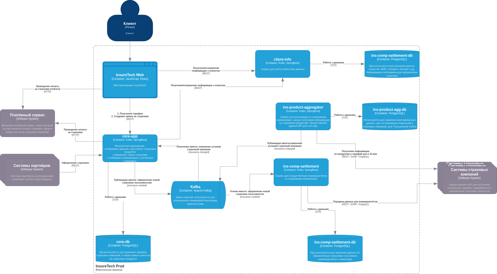

### Задание 4. Проектирование продажи ОСАГО
Компания планирует вскоре запустить новый продукт: оформление ОСАГО онлайн.
Пользовательский путь выглядит так:
клиенту предлагается заполнить заявку с информацией о своём автомобиле,
после этого сервис запрашивает у всех доступных страховых компаний предложения с условиями страхования под заявку клиента.
Бизнесу важно, чтобы на экране пользователя предложения от каждой страховой компании отображались сразу,
как только от неё пришёл ответ. Максимальное время ожидания решения от страховой компании — 60 секунд.

Все страховые компании предоставляют однотипные REST API с двумя эндпоинтами:
* создать заявку на ОСАГО,
* получить предложение по заявке.

Бизнес предполагает, что в пик нагрузки количество одновременных пользователей, создающих заявку на ОСАГО, может достигать 2,5 тысячи человек.

Вы обсудили задачу с командой разработки и приняли такие решения:
1. Сохранить подход, который использовался для получения данных о продуктах и тарифах из страховых компаний.
2. Выделить отдельный сервис для взаимодействия со страховыми компаниями — osago-aggregator.

Функциональная обязанность этого сервиса — отправка заявок в страховые компании и дальнейший опрос решений по ним для передачи результатов в core-app.
Остальная функциональность, связанная с оформлением ОСАГО, остаётся на стороне бэкенда в core-app.

Теперь вам нужно проработать ещё несколько моментов, исходя из требований бизнеса. Доработайте схему, которая у вас получилась в третьем задании.
Отразите на ней ваши решения по этим вопросам:
1. Проработайте реализацию osago-aggregator. Решите:
2. Требуется ли ему своё хранилище данных?
3. Какой API он предоставляет core-app?
4. Определите средство интеграции между сервисами core-app и osago-aggregator.
5. Подумайте над API для веб-приложения в core-app.
6. Определите средство интеграции между веб-приложением и core-app. Если будете использовать средство, отличное от REST, отразите интеграцию новой стрелкой.
7. В зависимости от выбранных средств интеграции подумайте, требуется ли где-то применение паттернов отказоустойчивости:
    * Rate Limiting
    * Circuit Breaker
    * Retry
    * Timeout
    * Outbox Transactional

   Отобразите применение паттернов на схеме с помощью обозначений из этой библиотеки.
8. Примите во внимание, что сервисы задеплоены в нескольких экземплярах. Подумайте, зависит ли ваше решение от этого.

Загрузите новый вариант схемы в директорию Task4 в рамках пул-реквеста.

### Решение:
1. **_Требуется ли для osago-aggregator своё хранилище данных?:_**
   Думаю, имеет смысл использовать в качестве хранилища то же самое, что уже использует ins-product-aggregator.
   Так мы сможем точно понимать, когда произошло изменение в данных страховых компаний,
   не отправляя в очередь ивент, который не изменяет условий.
   Также это хранилище я бы использовал для реализации паттерна Transactional Outbox,
   поскольку для нас критично не упустить изменения в условиях страхового полиса.
   Кроме того, благодаря данному хранилищу мы могли бы проводить аудит изменений страховых планов.

2. **_Какой API он предоставляет core-app?:_**
   Cинхронный REST, чтобы гарантировать ответ в 60 сек, а оформление ОСАГО - асинхронный через Kafka.

3. _**Определите средство интеграции между сервисами core-app и osago-aggregator:**_
   Был выбран точка-точка, так как события в топиках для ОСАГО от core-app предназначены только для osago-aggregator сервиса.

4. _**Подумайте над API для веб-приложения в core-app:**_
   REST, клиент делает сетевые запросы.

5. _**Определите средство интеграции между веб-приложением и core-app. Если будете использовать средство, отличное от REST, отразите интеграцию новой стрелкой:**_
   Буду использовать REST.

6. **_Rate Limiting:_**
   Так как мы ходим во внешние системы, к операторам страховок, то было бы неплохо гарантировать кол-во запросов,
   которые от нас исходят, чтобы не навредить партнёрам, а также, чтобы не израсходовать много ресурсов на избыточные запросы.
   Также используем для защиты своей системы, когда партнёры ходят к нам, также защитим core-app от клиента.

7. _**Circuit Breaker:**_
   Используем, чтобы не ходить во внешние системы, когда они недоступны.

8. _**Retry:**_
   Использовал бы при любом синхронном взаимодействии, единственное, нужно будет предусмотреть передачу и обработку уникального ключа для идемпотентности.

9. _**Timeout*:*_
   Для гарантии 60 сек ответа от страховых компаний, если нет ответа, то своему пользователю вернем заглушку/ошибку/дефолтное значение.
   Также используем во взаимодействии между своими сервисами, чтобы не стучаться в упавший сервис.

10. _**Outbox Transactional:**_
    Используем паттерн при любом событии, в хранилищах каждого сервиса создаём по таблице `outbox`,
    паттерн даст гарантию доставки сообщений, `at least once`, опять же предусмотрим использование уникального ключа для идемпотентности.

11. **_Примите во внимание, что сервисы задеплоены в нескольких экземплярах. Подумайте, зависит ли ваше решение от этого:_**
    Думаю, что стоит использовать уникальный ключ каждого события для идемпотентности и корректной обработки событий и запросов разными инстансами сервисов.

### Диаграмма компонентов системы as-is:

### Диаграмма компонентов системы to-be:
